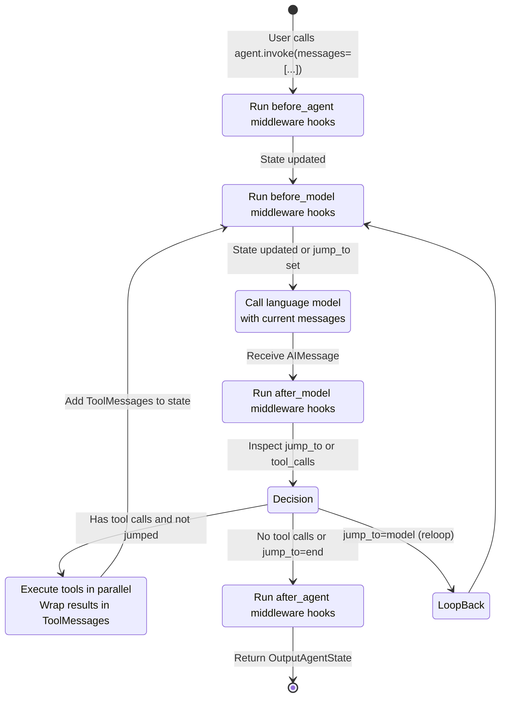

> 🌐 本文档由 [langchain-ai/langchain](https://github.com/langchain-ai/langchain) 翻译,英文原版见原项目。

## 总览

LangChain 采用**三层架构**,按职责拆分为抽象、编排与集成:

1. **langchain-core**:语言模型、工具、消息、runnable 和提示词模板的稳定基础抽象。该层与供应商无关,定义了生态中其余部分要实现的契约。

2. **langchain**(langchain-v1):高层智能体编排、中间件组合与 Agent Factory。构建在 LangGraph 和 langchain-core 之上,是构建智能体和应用的主要用户界面。

3. **partners**:供应商专属集成(OpenAI、Anthropic、Ollama 等)。每个 partner 包实现核心抽象(BaseChatModel、embeddings、tools),并独立发布。

这种结构实现了模型互操作、稳定版本管理和供应商独立演进,同时保持核心抽象在所有实现中的稳定。

## 依赖流向

<!-- openwiki: mermaid 解析失败,该图已转为文本围栏以免破坏渲染。修复图源码后可恢复 mermaid 围栏。 -->
```text
graph TB
    User["User Applications"]
    
    User -->|imports from| LangChain["langchain<br/>(Orchestration & Agents)<br/>v1.4.0"]
    User -->|may use directly| Core["langchain-core<br/>(Base Abstractions)<br/>v1.6.1"]
    
    LangChain -->|depends on| Core
    LangChain -->|depends on| LangGraph["LangGraph<br/>(State Graph Engine)"]
    
    Partners["Partner Packages<br/>(langchain-openai,<br/>langchain-anthropic, etc.)"]
    Partners -->|implement| Core
    
    User -->|optionally imports| Partners
    LangChain -->|uses| Partners
    
    Classic["langchain-classic<br/>(Legacy)<br/>v1.0.8"]
    Classic -->|depends on| Core
    
    style Core fill:#2d5016,stroke:#4a7c2c,color:#fff
    style LangChain fill:#1f3a70,stroke:#3d5a96,color:#fff
    style Partners fill:#5a3a1a,stroke:#7d5c3c,color:#fff
    style Classic fill:#4a4a4a,stroke:#666,color:#fff
    style LangGraph fill:#3d3d5c,stroke:#555,color:#fff
```

用户通常从 `langchain`(积极维护的包)导入,以使用智能体和高层编排。`langchain-core` 层也可直接用于构建自定义实现。Partner 包按需加载(常通过 `init_chat_model` 隐式完成),并独立于核心发布。`langchain-classic`(遗留)仅为向后兼容而维护,新项目不应使用。

## 三层架构

### 第 1 层:langchain-core(稳定基础抽象)

**负责**:定义 LangChain 生态所有实现契约的基类与协议。

**关键职责**:

- **Runnable 协议**:所有可组合单元的基础抽象。`Runnable[Input, Output]` 定义了 `invoke()`、`stream()`、`batch()` 及对应的异步变体。所有语言模型、工具、链和转换器都实现该接口。
  
- **BaseChatModel 与 LanguageModelInput**:聊天模型的抽象基类。所有供应商实现(ChatOpenAI、ChatAnthropic 等)都继承该类。负责消息编码、token 流式传输、结构化输出编组和 token 计数。

- **消息与消息类型**:规范的消息表示(AIMessage、ToolMessage、UserMessage、SystemMessage 等)。无论供应商是谁,都用统一的协议与模型交互。

- **工具(BaseTool)**:可执行工具的抽象。支持同步/异步调用、schema 生成和结构化参数解析。

- **提示词、输出解析器与检索器**:提示词模板、结构化输出解析和文档检索的基础抽象 —— 全部都是 Runnable。

- **回调与追踪**:用于插桩、日志以及集成 LangSmith 的回调管理器基础设施。

**稳定性保证**:langchain-core 执行严格的语义化版本策略,破坏性变更提前公告。核心抽象跨大版本保持稳定。

**位置**:`/libs/core/langchain_core/`

### 第 2 层:langchain(智能体编排与高层 API)

**负责**:Agent Factory、智能体中间件系统、高层聊天模型工厂,以及基于 LangGraph 的智能体执行编排。

**关键职责**:

- **Agent Factory(`create_agent()`)**:构建一个编译后的 LangGraph 状态机来编排智能体循环,处理模型调用、工具绑定、结构化输出解析和中间件组合,返回一个接受消息并产出模型响应与工具调用的 Runnable。

- **智能体中间件系统**:可插拔钩子(`wrap_model_call`、`wrap_tool_call`),用于在模型、工具和生命周期边界注入逻辑。中间件纵向组合,可以修改请求状态、动态重写工具、拦截模型响应并控制循环流向。

- **Init Chat Model(`init_chat_model()`)**:工厂函数,按供应商名和模型标识(如 `"openai:gpt-4o"`)动态加载并实例化聊天模型,负责供应商发现、依赖管理和配置注入。

- **结构化输出与响应格式化**:用于指定期望输出格式(JSON schema、Pydantic 模型、工具)的抽象,并把模型响应编组为类型化 Python 对象。

- **智能体状态管理**:`AgentState` schema、基于 reducer 的消息累积,以及临时控制字段(如供中间件驱动路由的 `jump_to`)。

**依赖**:
- 依赖 langchain-core 提供抽象(Runnable、BaseChatModel、tools、messages)
- 依赖 LangGraph 做状态管理与图编译
- 通过 init_chat_model 按需加载 partner 包

**位置**:`/libs/langchain_v1/langchain/agents/`、`/libs/langchain_v1/langchain/chat_models/`

### 第 3 层:Partner 集成(供应商专属实现)

**负责**:每个 partner 包为特定模型供应商或服务实现核心抽象。

**通用结构**:

- **聊天模型**(如 `ChatOpenAI`):继承 `BaseChatModel`,封装供应商 API,处理认证、token 计数、流式和成本跟踪。
- **Embeddings**(如 `OpenAIEmbeddings`):实现 embedding 模型接口。
- **工具**:供应商专属的工具包装器与工具集。
- **结构化输出支持**:强制输出 schema 的供应商专属策略(如函数调用、JSON 模式)。

**示例**:langchain-openai、langchain-anthropic、langchain-ollama、langchain-groq、langchain-mistralai

**发布策略**:Partner 包独立版本化。partner 包更新不需要 langchain 或 langchain-core 同步更新,反之亦然。每个 partner 自行管理其 API 版本锁定与兼容性。

**位置**:`/libs/partners/<provider>/langchain_<provider>/`

---

## 组件交互

### 聊天模型的解析与实例化

`init_chat_model()` 是聊天模型面向用户的主要入口:

<!-- openwiki: mermaid 解析失败,该图已转为文本围栏以免破坏渲染。 -->
```text
sequenceDiagram
    participant User
    participant InitCM as init_chat_model()
    participant Registry as Provider Registry
    participant Partner as Partner Package
    participant Model as ChatOpenAI

    User->>InitCM: init_chat_model(identifier="openai:gpt-4o",<br/>api_key=...)
    InitCM->>InitCM: Parse identifier to provider, model_name
    InitCM->>Registry: Lookup provider config
    Registry-->>InitCM: (module, class, factory_fn)
    InitCM->>Partner: Import langchain_openai
    Partner-->>InitCM: ChatOpenAI class
    InitCM->>Model: factory_fn(ChatOpenAI, model="gpt-4o",<br/>api_key=...)
    Model-->>InitCM: Initialized model instance
    InitCM-->>User: BaseChatModel (ChatOpenAI)
```

解析过程是惰性的:`init_chat_model()` 只在用户请求该供应商时才导入 partner 包,避免硬依赖。

### 智能体创建与图构建

调用 `create_agent()` 时,工厂构建一个 LangGraph 状态机:

<!-- openwiki: mermaid 解析失败,该图已转为文本围栏以免破坏渲染。 -->
```text
sequenceDiagram
    participant User
    participant Factory as Agent Factory
    participant StateGraph as LangGraph<br/>StateGraph
    participant Middleware as Middleware Stack
    participant Graph as Compiled Graph

    User->>Factory: create_agent(model, tools, middleware=[...])
    Factory->>Factory: Merge middleware state schemas
    Factory->>StateGraph: new StateGraph(merged_AgentState)
    Factory->>StateGraph: add_node("model", model_node)
    Factory->>StateGraph: add_node("tools", tool_node)
    Factory->>StateGraph: add_edge(START, entry_node)
    
    Factory->>Middleware: Compose wrap_model_call layers
    Factory->>Middleware: Compose wrap_tool_call layers
    
    Factory->>StateGraph: set_entry_point(entry_node)
    Factory->>StateGraph: add_conditional_edges(after_model_node,<br/>route_to_tools_or_exit)
    
    Factory->>Graph: compile()
    Graph-->>Factory: CompiledStateGraph
    Factory-->>User: Runnable agent
```

编译后的图是一个 `Runnable[InputAgentState, OutputAgentState]`。用户传入消息列表调用它;智能体在内部编排"模型-工具"循环。

### 智能体执行循环

图编译完成并被调用后,智能体按以下顺序执行:



`jump_to` 字段让中间件能够改写路由(如提前退出、重启模型、跳过工具)。`messages` 字段通过 `add_messages` reducer 累积所有消息(用户、助手、工具结果),为每次模型调用提供完整对话历史。

---

## 关键架构模式

### Runnable 组合

所有可组合单元(模型、链、工具、提示词模板)都实现 `Runnable` 协议,因此可以无缝组合:

```python
# langchain-core defines the pattern
chain = prompt | model | output_parser

# Works regardless of provider
model = init_chat_model("openai:gpt-4o")  # ChatOpenAI
model = init_chat_model("anthropic:claude-3")  # ChatAnthropic
```

供应商实现 `BaseChatModel`(一个 Runnable)后,组合方式完全一致。

### 作为可组合钩子的中间件

Agent Factory 支持多层中间件,每层实现一个或多个钩子:

- `wrap_model_call(request, handler)`:拦截并修改模型请求、重写工具、后处理响应或实现重试逻辑。
- `wrap_tool_call(request, handler)`:拦截工具调用、实现自定义执行或处理动态工具。
- 生命周期钩子:`before_agent`、`before_model`、`after_model`、`after_agent`。

中间件按栈组合(内 → 外),让可观测性、安全、日志等关注点以正交方式叠加。

### 供应商抽象

Partner 实现 `BaseChatModel`,并可自由扩展供应商特有功能。核心接口保持稳定:

```python
class BaseChatModel(Runnable[LanguageModelInput, AIMessage]):
    def invoke(self, input: LanguageModelInput) -> AIMessage: ...
    async def ainvoke(self, ...) -> AIMessage: ...
    def stream(self, input: LanguageModelInput) -> Iterator[AIMessageChunk]: ...
```

供应商特有的结构化输出、成本跟踪和流式选项叠加在其上,不破坏核心契约。用户因此能用最少的代码改动切换模型。

### 核心稳定,编排灵活

核心层(langchain-core)刻意保持极简与稳定。编排逻辑、中间件和高层模式放在 langchain 层,可以更快演进。Partner 保持独立,无需协调核心或 langchain 的发布即可快速接入新供应商。

---

## 版本与发布策略

- **langchain-core**(`v1.6.1`):稳定的基础抽象。大版本升级罕见且提前公告;弃用会提前多个次版本通知。这是生态中"最不动"的部分。

- **langchain**(`v1.4.0`):面向用户的主包。次版本可能新增智能体模式、中间件类型或编排改进;补丁版本修 bug。要求特定的 langchain-core 版本(如 `>=1.6.0,<2.0.0`)。

- **langchain-classic**(`v1.0.8`):向后兼容的遗留包。提供旧链、`langchain-community` 再导出和已弃用 API。新项目应使用 `langchain`。

- **Partner 包**:独立版本。langchain-openai、langchain-anthropic 等按各自节奏发布。Partner 声明依赖 langchain-core(必需),可选依赖 langchain(仅当它们提供中间件或智能体专属功能时)。

---

## 关键文件与符号

### langchain-core

- `Runnable[Input, Output]`(`/libs/core/langchain_core/runnables/base.py`):所有可组合单元的基础协议。定义 `invoke()`、`stream()`、`batch()` 及异步变体。

- `BaseChatModel`(`/libs/core/langchain_core/language_models/chat_models.py`):所有聊天模型的抽象基类,供应商继承该类。

- `BaseTool`(`/libs/core/langchain_core/tools/`):工具的抽象基类。支持 schema 生成、结构化参数解析和同步/异步执行。

- Messages(`/libs/core/langchain_core/messages/`):`AIMessage`、`ToolMessage`、`UserMessage`、`SystemMessage` 等,构成规范的消息表示。

### langchain

- `create_agent()`(`/libs/langchain_v1/langchain/agents/factory.py`):构建智能体图。接受模型、工具、中间件,返回编译后的 Runnable。

- `init_chat_model()`(`/libs/langchain_v1/langchain/chat_models/base.py`):按供应商标识动态加载聊天模型的工厂函数。

- `AgentMiddleware`(`/libs/langchain_v1/langchain/agents/middleware/types.py`):中间件基类。用户继承它实现自定义钩子。

- `AgentState`(`/libs/langchain_v1/langchain/agents/middleware/types.py`):定义智能体状态 schema 的 TypedDict。可通过中间件的 `state_schema` 属性扩展。

### Partners

- `ChatOpenAI`(`/libs/partners/openai/langchain_openai/chat_models/base.py`):继承 BaseChatModel,封装 OpenAI API,处理流式与结构化输出。

- Anthropic、Groq、Ollama、Mistral 等其他供应商有类似实现。

---

## 扩展点

### 实现自定义模型供应商

新增供应商(如私有 LLM 服务)的步骤:

1. 新建包:`langchain_myprovider/`
2. 用你的 API 客户端继承 `BaseChatModel`
3. 实现必需方法:`_generate()`(支持流式则实现 `_stream()`)、`_llm_type`、`model_parameters`
4. 可选:为供应商特性添加中间件
5. 通过 PR 注册到 `init_chat_model()`(或独立发布,用户直接实例化)

### 实现中间件

添加横切关注点(日志、限流、校验)的步骤:

1. 继承 `AgentMiddleware`
2. 实现一个或多个钩子:`wrap_model_call()`、`wrap_tool_call()`、`before_agent()`、`after_agent()` 等
3. 可选:声明 `state_schema` 扩展智能体状态
4. 传给 `create_agent(middleware=[...])`

中间件纵向堆叠;每层可包裹下一层,让互不相关的关注点得以组合。

### 自定义工具

工具也是 Runnable,可用 `@tool` 注解的 Python 函数定义,或继承 `BaseTool`:

```python
from langchain_core.tools import BaseTool

class MyTool(BaseTool):
    name = "my_tool"
    description = "Does something useful"
    
    def _run(self, arg: str) -> str:
        return f"Result for {arg}"
```

工具在创建时绑定到智能体,供模型调用。

---

## 依赖摘要

| 包 | 依赖 | 角色 |
|---------|-----------|------|
| **langchain-core** | langsmith, httpx, pydantic | 基础抽象;稳定 |
| **langchain** | langchain-core, langgraph, pydantic | 智能体编排;面向用户 |
| **langchain-classic** | langchain-core, langchain-text-splitters, pydantic | 遗留链与 community 再导出 |
| **langchain-openai** | langchain-core, openai SDK | OpenAI 集成(ChatOpenAI、embeddings) |
| **langchain-anthropic** | langchain-core, anthropic SDK | Anthropic 集成(ChatAnthropic) |
| **langchain-ollama** | langchain-core, ollama SDK | Ollama 集成(ChatOllama) |
| **langchain-groq** | langchain-core, groq SDK | Groq 集成(ChatGroq) |

Partner 只依赖 langchain-core(抽象层),不依赖 langchain(编排层),因此可以独立发布。
