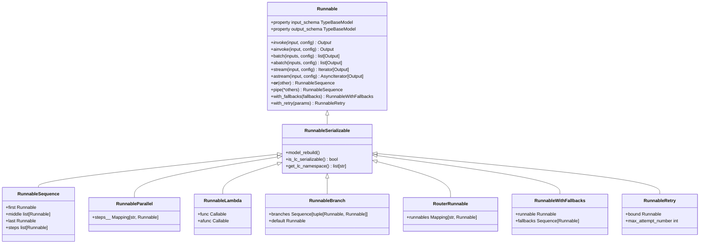
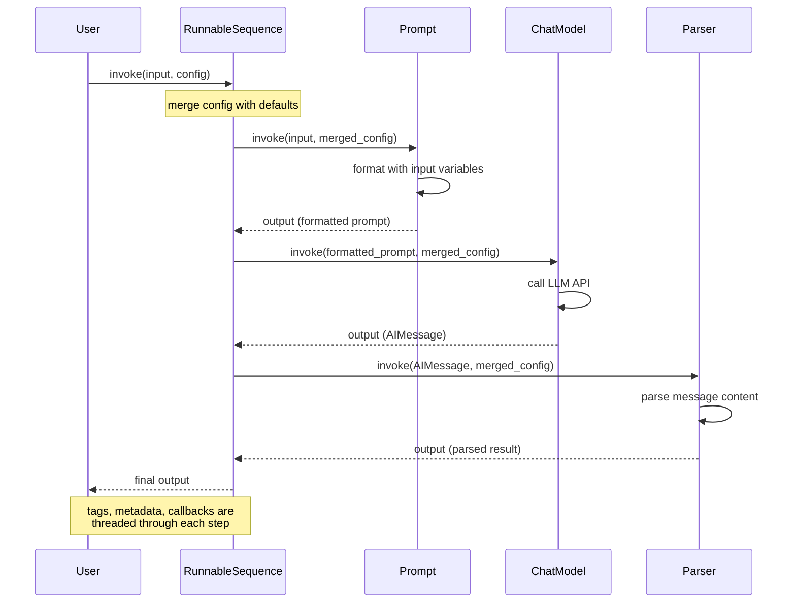

> 🌐 本文档由 [langchain-ai/langchain](https://github.com/langchain-ai/langchain) 翻译,英文原版见原项目。
>
> ⚠️ 原文超过 10000 字符,本页翻译核心章节;代码块、图表保持原样,完整细节见英文原版。

## 总览

**Runnable** 是 LangChain 核心层的基础抽象。它定义了一个可序列化、可组合的接口,每个 LLM 组件 —— 提示词、模型、工具、链、输出解析器 —— 都必须实现。`Runnable` 是把输入转换为输出的工作单元,通过五种核心操作完成:同步 invoke、异步 invoke、批处理、流式,以及输入/输出 schema 自省。

**LangChain 表达式语言(LCEL)**利用 Runnable,用组合运算符声明式地构建链。任何由 Runnable 构成的链自动继承同步、异步、批处理和流式支持,无需额外实现。这统一了执行模式,并支持复杂的控制流 —— 顺序管道(`|`)、并行分叉(`+`)、分支、回退处理和重试逻辑 —— 全部都是一等可组合操作。

## 核心 Runnable 协议

**位置**:`repo://libs/core/langchain_core/runnables/base.py#L133-L265`

`Runnable` 抽象基类定义所有组件的契约。Runnable 对输入和输出类型泛型(`Runnable[Input, Output]`),必须实现抽象方法 `invoke`。其余执行方法都有默认实现,子类可重写以做优化。

### 关键职责

1. **Invoke**:同步执行单个输入,返回单个输出。
2. **Batch**:并行处理多个输入(默认用线程池,子类可优化)。
3. **Stream**:随产出逐段输出(默认调用一次 invoke;流式模型有专门实现)。
4. **异步变体**:invoke、batch、stream 的异步版本(默认经 executor 委托给同步;子类可原生实现)。
5. **Schema 自省**:把输入类型、输出类型和配置 schema 暴露为 Pydantic 模型,供校验和工具使用。
6. **组合**:支持通过运算符和方法与其他 Runnable 链接。

### 同步方法

**`invoke(input, config=None)`**(`repo://libs/core/langchain_core/runnables/base.py#L885-L906`)是抽象核心方法:

```python
@abstractmethod
def invoke(
    self,
    input: Input,
    config: RunnableConfig | None = None,
    **kwargs: Any,
) -> Output:
    """Transform a single input into an output."""
```

- **所有子类必须实现**。
- 接受可选 `RunnableConfig`,携带 tags、metadata、callbacks、递归限制和可配置参数。
- 返回单个输出。

**`batch(inputs, config=None, return_exceptions=False)`**(`repo://libs/core/langchain_core/runnables/base.py#L931-L975`)处理多个输入:

```python
def batch(
    self,
    inputs: list[Input],
    config: RunnableConfig | list[RunnableConfig] | None = None,
    *,
    return_exceptions: bool = False,
    **kwargs: Any | None,
) -> list[Output]:
    """Default implementation runs invoke in parallel using a thread pool executor."""
```

- **默认**:经 `ThreadPoolExecutor` 并行对每个输入调用 `invoke`。
- 接受单个配置(应用到全部)或配置列表(每个输入一个)。
- `return_exceptions=True` 时,异常原样出现在输出列表;否则直接抛出。
- 有批量感知后端的子类可重写(如支持批量 API 的 LLM)。

**`batch_as_completed(inputs, config=None, return_exceptions=False)`** 随完成随产出,适合边处理边流出部分结果。

**`stream(input, config=None)`**(`repo://libs/core/langchain_core/runnables/base.py#L1194-L1213`)逐段产出:

```python
def stream(
    self,
    input: Input,
    config: RunnableConfig | None = None,
    **kwargs: Any | None,
) -> Iterator[Output]:
    """Default implementation of stream, which calls invoke."""
```

- **默认**:产出 `invoke` 的一个完整输出。
- **专门实现**(如聊天模型、token 流式解析器)随到达逐块产出。
- 通过渐进式输出展示带来响应式体验。

### 异步方法

**`ainvoke(input, config=None)`**(`repo://libs/core/langchain_core/runnables/base.py#L908-L929`)是异步变体:

```python
async def ainvoke(
    self,
    input: Input,
    config: RunnableConfig | None = None,
    **kwargs: Any,
) -> Output:
    """Transform a single input into an output."""
```

- **默认**:经 `run_in_executor` 委托给同步 `invoke`。
- **子类重写**以实现原生异步(如异步 API 调用)。

**`abatch(inputs, config=None, return_exceptions=False)`**(`repo://libs/core/langchain_core/runnables/base.py#L1066-L1112`)异步批量:

```python
async def abatch(
    self,
    inputs: list[Input],
    config: RunnableConfig | list[RunnableConfig] | None = None,
    *,
    return_exceptions: bool = False,
    **kwargs: Any | None,
) -> list[Output]:
    """Default implementation runs ainvoke in parallel using asyncio.gather."""
```

- 对每个输入并发调用 `ainvoke`。
- 遵循配置中的 `max_concurrency` 限制并行度。

**`abatch_as_completed(inputs, config=None, return_exceptions=False)`** 随异步完成即产出。

**`astream(input, config=None)`**(`repo://libs/core/langchain_core/runnables/base.py#L1215-L1234`)是异步流式变体:

```python
async def astream(
    self,
    input: Input,
    config: RunnableConfig | None = None,
    **kwargs: Any | None,
) -> AsyncIterator[Output]:
    """Default implementation of astream, which calls ainvoke."""
```

- **默认**:产出 `ainvoke` 的一个输出。
- 流式后端有**专门实现**。

### Schema 自省

**`input_schema` / `output_schema`**(`repo://libs/core/langchain_core/runnables/base.py#L374-L527`)把输入与输出类型暴露为 Pydantic 模型:

```python
@property
def input_schema(self) -> TypeBaseModel:
    """The type of input this Runnable accepts specified as a Pydantic model."""
    return self.get_input_schema()

@property
def output_schema(self) -> TypeBaseModel:
    """The type of output this Runnable produces specified as a Pydantic model."""
    return self.get_output_schema()
```

- 从泛型参数或实现者提供的类型标注推断。
- 可转换为 JSON Schema,用于 API 文档、校验和工具链。

**`config_schema(include=None)`** 返回配置字段的 Pydantic 模型,字段需经 `configurable_fields()` 或 `configurable_alternatives()` 标记为可配置。

## 组合运算符与方法

LCEL 的核心是声明式组合。Runnable 用运算符和方法链接,生成新的复合 Runnable。

### 顺序组合:管道运算符 `|`

**`__or__(other)` / `__ror__(other)`**(`repo://libs/core/langchain_core/runnables/base.py#L648-L722`)创建 `RunnableSequence`:

```python
def __or__(self, other):
    """Runnable "or" operator. Compose this Runnable with another to create RunnableSequence."""
    return RunnableSequence(self, coerce_to_runnable(other))
```

**示例**:
```python
from langchain_core.runnables import RunnableLambda
from langchain_core.prompts import PromptTemplate
from langchain_core.output_parsers import StrOutputParser

prompt = PromptTemplate.from_template("Tell me about {topic}")
model = ChatOpenAI()
parser = StrOutputParser()

chain = prompt | model | parser
result = chain.invoke({"topic": "machine learning"})
# result is a string, the parsed model output
```

- `other` 可以是另一个 `Runnable`、可调用对象、字典(强转为 `RunnableParallel`)或任意 `RunnableLike`。
- 自动展平嵌套 `RunnableSequence` 以提高效率。
- 左侧输出成为右侧输入。

**`pipe(*others, name=None)`**(`repo://libs/core/langchain_core/runnables/base.py#L724-L771`)是显式方法形式:

```python
sequence = runnable_1.pipe(runnable_2, runnable_3)
# Equivalent to: runnable_1 | runnable_2 | runnable_3
```

### 并行组合:字典分叉

**字典字面量**或 **`RunnableParallel`**(`repo://libs/core/langchain_core/runnables/base.py#L3864-L3990`)用同一输入并发调用多个 Runnable:

```python
from langchain_core.runnables import RunnableParallel

# Via dict literal in a sequence
sequence = input_runnable | {
    "branch_a": runnable_a,
    "branch_b": runnable_b,
}

# Explicit RunnableParallel
parallel = RunnableParallel(
    result1=runnable_1,
    result2=runnable_2,
)
```

- 所有 runnable 收到相同输入。
- 结果按用户指定的键收进一个字典。
- 经 `asyncio.gather` 或线程池并行执行。
- 适合并行处理分支:多链检索、多角度分析等。

### 顺序执行:RunnableSequence

**位置**:`repo://libs/core/langchain_core/runnables/base.py#L3075-L3235`

`RunnableSequence` 是顺序执行的组合引擎。它串联多个 `Runnable`,每一步的输出作为下一步输入。`first`、`middle`、`last` 属性保存各步骤;序列按顺序调用每步的 batch/stream 方法,自动优化批处理和流式。

```python
from langchain_core.runnables import RunnableSequence

sequence = RunnableSequence(
    first=prompt,
    middle=[some_runnable],
    last=parser,
)

# Equivalent to: prompt | some_runnable | parser
```

**关键行为**:
- **批处理**:序列中每一步都以上一步的批量输入调用。若某步的 batch 有优化(如 LLM API),整条链都受益。
- **流式**:若所有步骤都实现 `transform`(流式输入 → 流式输出),序列可端到端流式;否则从最后一个阻塞步骤之后开始流式。
- **异步**:异步变体按序调用每步的异步方法,链内可并行步骤经 `asyncio.gather` 并行。

### 分支:RunnableBranch

**位置**:`repo://libs/core/langchain_core/runnables/branch.py#L43-L150`

`RunnableBranch` 按条件选择并运行其中一个分支:

```python
from langchain_core.runnables import RunnableBranch

branch = RunnableBranch(
    (lambda x: isinstance(x, str), lambda x: x.upper()),
    (lambda x: isinstance(x, int), lambda x: x + 1),
    lambda x: "default",  # fallback if no condition matches
)

branch.invoke("hello")  # "HELLO"
branch.invoke(42)       # 43
branch.invoke(None)     # "default"
```

- 接受 `(condition, runnable)` 元组列表和一个默认 runnable。
- 条件是返回布尔值的 Runnable 或可调用对象。
- invoke 时选中第一个返回 `True` 的条件,对其 runnable 执行输入。
- 无条件匹配时运行默认 runnable。
- 条件按顺序求值;复杂逻辑请谨慎使用。

### 路由:RouterRunnable

**位置**:`repo://libs/core/langchain_core/runnables/router.py#L46-L150`

`RouterRunnable` 按键路由到 runnable:

```python
from langchain_core.runnables import RouterRunnable

router = RouterRunnable(runnables={
    "math": math_chain,
    "text": text_chain,
})

router.invoke({"key": "math", "input": "2 + 2"})  # Uses math_chain
```

- 输入是含 `"key"`(标识路由的字符串)和 `"input"`(实际数据)的字典。
- 被选中的 runnable 处理输入。
- 适合分发表和多专家架构。

### 回退与重试

**回退**:`RunnableWithFallbacks`(`repo://libs/core/langchain_core/runnables/fallbacks.py#L37-L150`)

```python
from langchain_core.runnables import RunnableWithFallbacks

model = ChatOpenAI().with_fallbacks([ChatAnthropic(), ChatCohere()])
# Try ChatOpenAI first, then ChatAnthropic, then ChatCohere if prior ones fail.

result = model.invoke("Hello")  # Returns first successful result
```

- 先执行主 runnable。
- 若抛出 `exceptions_to_handle` 中的异常,尝试下一个回退。
- 直到某个成功或全部失败。
- 可选择把异常传给回退以自适应恢复。

**重试**:`RunnableRetry`(`repo://libs/core/langchain_core/runnables/retry.py#L48-L150`)

```python
runnable = ChatOpenAI().with_retry(
    retry_if_exception_type=(APIError,),
    stop_after_attempt=3,
    wait_exponential_jitter=True,
)
# Retries on APIError up to 3 times with exponential backoff + jitter.
```

- 基于 `tenacity` 实现重试。
- 可配置停止条件、等待策略和异常类型。
- 最好作用于单个 runnable(如 LLM 调用)而非整条链。

## RunnableConfig:上下文贯穿

**位置**:`repo://libs/core/langchain_core/runnables/config.py#L57-L129`

`RunnableConfig` 是贯穿链路的执行上下文 `TypedDict`:

```python
class RunnableConfig(TypedDict, total=False):
    tags: list[str]              # For filtering runs, grouping telemetry
    metadata: dict[str, Any]     # Arbitrary metadata (JSON-serializable)
    callbacks: Callbacks         # Lifecycle handlers (on_start, on_end, on_error, etc.)
    run_name: str                # Name for tracing/logging
    max_concurrency: int | None  # Limit parallel execution
    recursion_limit: int         # Prevent infinite recursion (default 25)
    configurable: dict[str, Any] # Runtime config overrides for configurable fields
    run_id: uuid.UUID | None     # Unique execution ID
```

- **传播**:配置经上下文变量(`var_child_runnable_config`)与显式参数传递贯穿子 runnable。
- **合并**:配置向下传递时合并(如 tags 累积:父 tags + 子 tags)。
- **回调**:挂载的回调收到所有中间步骤的钩子,支持可观测与自定义逻辑。
- **可配置字段**:`configurable` 字典为 `configurable_fields()` 或 `configurable_alternatives()` 标记的字段提供运行时取值,实现动态行为。

## 核心 Runnable 类型

### RunnableLambda

**位置**:`repo://libs/core/langchain_core/runnables/base.py#L4703-L4850`

`RunnableLambda` 把 Python 可调用对象包装为 `Runnable`:

```python
from langchain_core.runnables import RunnableLambda

def add_one(x: int) -> int:
    return x + 1

runnable = RunnableLambda(add_one)
runnable.invoke(1)  # 2

# Async support
async def add_one_async(x: int) -> int:
    return x + 1

runnable = RunnableLambda(add_one, afunc=add_one_async)
await runnable.ainvoke(1)  # 2
```

- 适合包装自定义逻辑、数据转换和简单操作。
- lambda 返回 `Runnable` 时,该 runnable 会被自动调用。
- 默认不支持流式(流式 lambda 用 `RunnableGenerator`)。
- 自动检测异步可调用对象,提供原生异步支持。

### RunnableGenerator

包装生成器函数(同步或异步),创建流式 runnable。

### RunnableParallel

如上所述;同一输入并发运行多个 runnable,结果收集进字典。

### RunnableMap(RunnableParallel 的别名)

与 `RunnableParallel` 同义。

### RunnablePassthrough

**位置**:`repo://libs/core/langchain_core/runnables/passthrough.py`

原样透传输入,在并行分支中常用于为后续步骤保留输入。

```python
from langchain_core.runnables import RunnablePassthrough

chain = prompt | {
    "original_input": RunnablePassthrough(),
    "model_output": model,
}
# Output: {"original_input": <input>, "model_output": <model result>}
```

### RunnablePick

从字典输出中选取特定键:

```python
chain | RunnablePick("key_a")  # Output only "key_a"
# Or: chain.pick(["key_a", "key_b"])
```

### RunnableAssign

调用额外 runnable,向字典输出添加新字段:

```python
chain.assign(new_field=some_runnable)
# Output now includes original fields + new_field
```

## Runnable 层级

下图展示核心 Runnable 类层级:



核心 Runnable 类型的类层级及其关系。

## 执行流程:invoke 与配置传播

下图展示配置与执行如何在组合链中流转:



顺序组合中的执行流程与配置传播。

## RunnableLike 与类型强转

**位置**:`repo://libs/core/langchain_core/runnables/base.py#L6608-L6664`

`RunnableLike` 是接受一切可组合物的联合类型:

```python
RunnableLike = (
    Runnable[Input, Output]
    | Callable[[Input], Output]
    | Callable[[Input], Awaitable[Output]]
    | Callable[[Iterator[Input]], Iterator[Output]]
    | Callable[[AsyncIterator[Input]], AsyncIterator[Output]]
    | Mapping[str, Any]
)
```

**`coerce_to_runnable(thing)`** 把任意 `RunnableLike` 转为 `Runnable`:

```python
def coerce_to_runnable(thing: RunnableLike) -> Runnable:
    """Coerce a Runnable-like object into a Runnable."""
    if isinstance(thing, Runnable):
        return thing  # Already a Runnable
    if is_async_generator(thing) or inspect.isgeneratorfunction(thing):
        return RunnableGenerator(thing)  # Wrap generators
    if callable(thing):
        return RunnableLambda(thing)  # Wrap functions
    if isinstance(thing, dict):
        return RunnableParallel(thing)  # Coerce dicts to parallel
    raise TypeError("...")  # Unsupported type
```

因此才有直观语法:`prompt | my_function | {"field": another_function}`。每个元素都被自动强转为 Runnable。

## 配置与扩展

### 可配置字段

**`configurable_fields(**fields)`** 把字段标记为运行时可配置:

```python
from langchain_core.runnables import ConfigurableField

model = ChatOpenAI(
    model="gpt-4"
).configurable_fields(
    model=ConfigurableField(
        id="model_name",
        name="Model Name",
        description="The model to use",
    )
)

# At runtime, override the model:
result = model.invoke(
    "Hello",
    config={"configurable": {"model_name": "gpt-3.5-turbo"}}
)
```

- 字段暴露在 `config_schema()` 中。
- 运行时取值在 invoke 前生效。

### 回调与追踪

Runnable 经 `RunnableConfig` 与回调系统集成:

```python
from langchain_core.tracers import ConsoleCallbackHandler

chain.invoke(
    input,
    config={
        "callbacks": [ConsoleCallbackHandler()],
        "tags": ["production", "query"],
        "metadata": {"user_id": 123},
    }
)
```

回调收到以下钩子:
- `on_runnable_start`:某步骤开始
- `on_runnable_end`:某步骤成功完成
- `on_runnable_error`:某步骤失败
- `on_llm_new_token`:逐 token 流式
- 以及更多

由此实现实时监控、自定义日志、用户归因和性能追踪。

## 一切组件皆是 Runnable

关键设计原则:**一切皆 Runnable**。包括:

- **提示词**(`PromptTemplate`、`ChatPromptTemplate`):把输入变量格式化为消息。
- **聊天模型**(`ChatOpenAI`、`ChatAnthropic`):调用 LLM API。
- **输出解析器**(`JsonOutputParser`、`StrOutputParser`):把模型输出解析为结构化类型。
- **检索器**(`VectorStoreRetriever`、`BM25Retriever`):获取相关文档。
- **工具**(`BaseTool`):带 schema 的可调用函数。
- **链**:由其他 runnable 构成的复合 runnable。
- **智能体**:在反馈循环中编排工具与 runnable。

因为全是 Runnable,任意两者都可用 `|` 组合,统一地并行、重试和监控。

## 简单示例:Prompt → Model → Parser 链

```python
from langchain_core.prompts import PromptTemplate
from langchain_core.chat_models import ChatOpenAI
from langchain_core.output_parsers import JsonOutputParser

# Define input schema
class TopicInfo(BaseModel):
    topic: str
    examples: list[str]

# Create the chain
prompt = PromptTemplate.from_template(
    "Provide 3 examples of {topic} in JSON format:\n"
    "{format_instructions}"
)
model = ChatOpenAI(model="gpt-4")
parser = JsonOutputParser(pydantic_object=TopicInfo)

chain = prompt | model | parser

# Invoke
result = chain.invoke({
    "topic": "machine learning algorithms",
    "format_instructions": parser.get_format_instructions(),
})
# result is a TopicInfo instance with topic and examples

# Batch
results = chain.batch([
    {"topic": "AI", ...},
    {"topic": "NLP", ...},
    {"topic": "Vision", ...},
])
# results is a list of TopicInfo instances, processed in parallel

# Stream
for chunk in chain.stream({"topic": "Reinforcement Learning", ...}):
    print(chunk)  # Yields intermediate outputs as they arrive
```

## 关键不变量与设计模式

### 可序列化

所有核心 Runnable 都可通过 LangChain 序列化系统序列化。这使得:
- 把链保存为 JSON 或 YAML 用于部署
- 从持久化配置重建链
- 跨服务共享链定义

### 不可变与流畅 API

组合方法(`with_fallbacks`、`with_retry`、`pick`、`assign` 等)返回新的 `Runnable` 实例,不修改原对象。因此可以安全链式调用并复用组件。

### 类型透明

输入与输出类型被暴露并强制:
- `input_schema` 在 invoke 前校验输入
- `output_schema` 为工具和 UI 文档化期望输出
- JSON schema 生成支持 API/OpenAPI 文档

### 惰性执行

链是惰性构建的 —— 用 `|` 组合不会执行任何东西。只有调用 `invoke`、`batch`、`stream` 或其异步变体时才执行。

### 流式是一等公民

流式不是事后补丁,而是核心执行模式。每个 Runnable 都暴露 `stream` 和 `astream`,实现响应式与增量输出。

### 并发与并行

批量操作用线程池或 asyncio 并发处理输入。配置经 `max_concurrency` 控制并行度。异步方法是一等公民,支撑高并发服务端部署。
